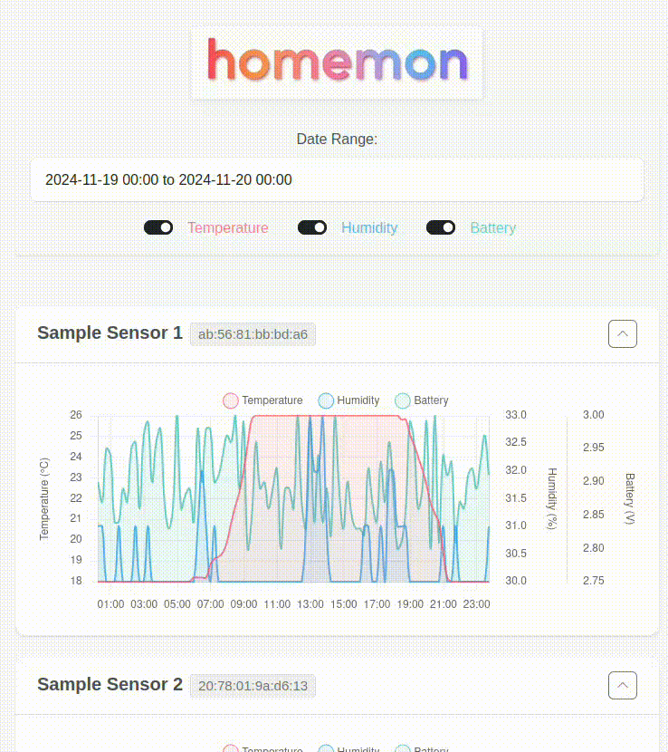

<div style="text-align: center;">

</div>

# Home Monitor

Home Monitor is a project that monitors, stores and visualizes temperature, humidity, and battery level measurements from **Xiaomi Mi Temperature and Humidity Monitor 2 (LYWSD03MMC)** sensors, helping you track environmental conditions in your home.

The project consists of three main components:

1. `monitor.py` - A Python script that connects to the Xiaomi sensors via Bluetooth LE, periodically collects measurements, and stores them in an SQLite database for historical tracking
2. `run_api.py` - A FastAPI-based REST API server that provides secure access to the stored sensor data and serves the web interface
3. `webui/index.html` - A responsive single-page web application that displays real-time and historical sensor data through interactive charts and visualizations

## Features of Home Monitor

- Continuously polls specified Xiaomi sensors using Bluetooth LE.
- Stores sensor data (temperature, humidity, battery level) in a local SQLite database.
- Provides a configurable polling interval and database path via a YAML configuration file.
- Supports multiple sensors, each identified by its MAC address and optionally given a user-friendly alias.
- Includes a sensor discovery script (`discover_sensors.py`) to easily find and add new sensors to the configuration.
- Offers a FastAPI-based REST API for secure access to sensor data.
- Presents a responsive, single-page web application (`webui/index.html`) for real-time and historical data visualization using interactive charts.
- Uses a robust and efficient SQLite database for data storage and retrieval.
- Includes a sample data generation script (`generate_sample_data.py`) for testing and development purposes.

<div style="text-align: center;">

</div>

## Usage of Home Monitor

### How to find out MAC address of your Xiaomi Mi Temperature and Humidity Monitor 2 (LYWSD03MMC)

#### Using the Discovery Script

The project includes a sensor discovery script that can automatically find your Xiaomi sensors and optionally add them to your configuration:

To just discover sensors and print their MAC addresses:

    ./discover_sensors.py

To discover sensors and add them to your config file:

    ./discover_sensors.py --config config.yaml

When run with the `--config` option, the script will:
- Show only newly discovered sensors (not already in your config)
- Allow you to set friendly aliases for each sensor
- Automatically update your config file

#### Manual Discovery Method

If you prefer to find sensors manually, you can use the bluetoothctl command:

    bluetoothctl
    power on
    scan on
    ...
    [bluetooth]# [NEW] Device A4:C1:38:DE:EA:B9 LYWSD03MMC
    ...
    scan off
    exit

### Configuration

The script reads configuration from `config.yaml`.

**Configuration Options (config.yaml):**

- `polling_interval`: The time interval (in seconds) between sensor readings. Defaults to 900 seconds (15 minutes if not set).
- `database_file`: The path to the SQLite database file. Defaults to `sensor_data.db` if not set.
- `sensors`: A list of dictionaries, each defining a sensor with `mac_address` (required) and an optional `alias`.

Example `config.yaml`:

```yaml
# Polling interval in seconds (default: 900 seconds = 15 minutes if not set)
polling_interval: 900

# Database filename (default: sensor_data.db if not set)
database_file: "sensor_data.db"

# List of sensors with their MAC addresses and optional aliases
sensors:
  - mac_address: "A4:C1:38:DE:EA:B9"
    alias: "Living Room"
   - mac_address: "A4:C1:38:DE:EA:BF"
     alias: "Bedroom"
```

### Running the Monitor

To start monitoring:

    ./monitor.py

The script will continuously poll the specified sensors and store the data in the database.  Press Ctrl+C to stop.


# Sample Data Generation

The project includes a script `generate_sample_data.py` that can create sample SQLite databases in the homemon format. This is useful for testing and development purposes.

## Features of Sample Data Generation

- Generates realistic temperature patterns (18-26°C range with daily variations)
- Creates correlated humidity data (30-60% range)
- Includes battery voltage values (2.8-3.0V)
- Configurable number of sensors and samples
- Adjustable sampling interval
- Uses the homemon SensorDatabase class

## Usage of Sample Data Generation

Basic usage with default values (2 sensors, 50 samples each, 15-minute intervals):

    ./generate_sample_data.py --db-path test/sample.db

All available options:

    ./generate_sample_data.py --db-path test/sample.db --samples 100 --sensors 3 --interval 30

Options:
- `--db-path`: Path to the output SQLite database (required)
- `--samples`: Number of samples per sensor (default: 50)
- `--sensors`: Number of sensors to simulate (default: 2)
- `--interval`: Sampling interval in minutes (default: 15)

# API Server

The project includes a FastAPI server (`run_api.py`) that provides a web interface and API endpoints for accessing sensor data.

## Features of API Server

- Serves the web UI static files
- Provides API endpoints for accessing sensor data
- Handles CORS for cross-origin requests
- Includes development-specific middleware for caching control

## Usage of API Server

To start the API server with default settings:

    ./run_api.py

The server provides:
- Web UI access at the root path (/)
- API endpoints under /api
- Static files under /static

### Command Line Options

- `--db`: Path to the SQLite database file (default: sensor_data.db)
- `--host`: Host to bind the server to (default: 0.0.0.0)
- `--port`: Port to bind the server to (default: 8000)

Example with custom settings:

    ./run_api.py --db custom.db --port 8080

# Telegram Bot

The project includes a Telegram bot (`run_bot.py`) that provides convenient access to sensor data and system information through Telegram messages.

## Features of Telegram Bot

- Secure access through configurable allowed chat IDs
- Real-time sensor data retrieval
- Historical data analysis and visualization
- System control and monitoring capabilities

## Bot Commands

- `/recent` - Shows the latest measurements from all sensors
- `/average [hours]` - Displays average values for each sensor over the specified hours (default: 24h)
- `/graphs [hours]` - Generates temperature, humidity, and battery level graphs for the specified time period (default: 24h)
- `/wifi` - Shows current WiFi connection details (SSID, signal strength, IP, etc.)
- `/scan_wifi` - Shows available WiFi networks sorted by signal strength
- `/ping [address]` - Pings specified address or gateway if not specified
- `/ota` - Updates code from git repository (git pull)
- `/reboot` - Reboots the system (requires sudo privileges)
- `/shutdown` - Safely shuts down the system (requires sudo privileges)
- `/help, /commands` - Shows list of available commands

## Setup

1. Create a new bot and get your bot token:
   - Message @BotFather on Telegram
   - Use the `/newbot` command and follow instructions
   - Save the bot token you receive

2. Get your chat ID:
   - Message @userinfobot on Telegram
   - Use the `/start` command
   - Note down your chat ID

3. Configure the bot:
   - Create `config.telegram.yaml` with your bot token and allowed chat IDs:
```yaml
# Your bot token from @BotFather
bot_token: "YOUR_BOT_TOKEN_HERE"

# List of allowed chat IDs (can be obtained by sending /start to @userinfobot)
allowed_chat_ids:
  - 123456789  # Replace with your chat ID
  # Add more chat IDs as needed
```

## Usage

To start the Telegram bot:

    ./run_bot.py

The bot will start monitoring for commands from authorized users. Only users whose chat IDs are listed in the configuration file will be able to interact with the bot.

Note: The bot requires the API server to be running, as it fetches data through the API endpoints.


## Tips for Raspbian

To make sure the bot can scan wifi networks without sudo:

    $ sudo cat /etc/polkit-1/rules.d/50-nmcli-wifi-rescan.rules
    polkit.addRule(function(action, subject) {
        if (action.id == "org.freedesktop.NetworkManager.wifi.scan" &&
            subject.isInGroup("netdev")) {
            return polkit.Result.YES;
        }
    });


Add your user to the netdev group:

    sudo usermod -aG netdev $USER
